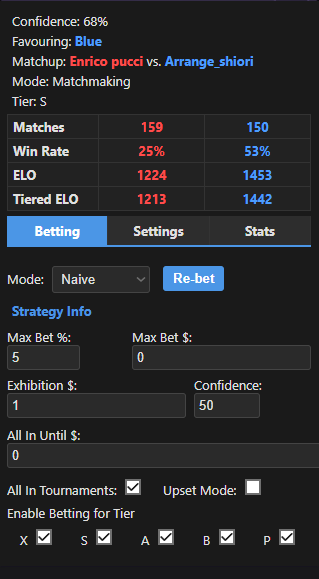

# SaltyPro

SaltyPro is an advanced Chrome extension that enhances the SaltyBet experience with automated betting features and detailed fighter analytics.

## Features

- **Smart automated betting** based on fighter statistics and match history
- **Detailed fighter analytics** with win/loss records, ELO ratings, and match data
- **Head-to-head statistics** when fighters have faced each other before
- **Multiple betting strategies** including naive, ELO-based, and tier-based algorithms
- **Customizable betting settings** for maximum control
- **Improved data refresh** functionality to eliminate constant manual refreshing

## Installation

[Add to Chrome](https://chrome.google.com/webstore/detail/saltypro/eocgcmccjmhiheehmpkgohneocaongn)

## How It Works

SaltyPro connects to a database of fighter statistics to analyze matchups. It uses various algorithms to determine bet confidence and can automatically place bets based on your settings.

When a match begins, the extension:
1. Retrieves fighter statistics from the API
2. Analyzes win rates, ELO ratings, and previous matchups
3. Determines optimal bet strategy and confidence level
4. Places bet according to your configured settings

## Configuration Options

- **Betting Mode**: Choose between different betting algorithms
- **All In Until**: Set a balance threshold for all-in betting
- **Max Bet Percentage**: Limit bets to a percentage of your balance
- **Max Bet Amount**: Set a hard cap on bet amounts
- **Tier-specific Betting**: Enable/disable betting on specific fighter tiers
- **Upset Mode**: Bet against algorithm recommendations (for when underdogs are winning)

## Privacy

SaltyPro respects your privacy:
- No personal data is collected
- All settings are stored locally in your browser
- The extension only communicates with the SaltyBet API for fighter statistics

## Development

This extension is built with JavaScript and uses the Chrome Extension API.

To contribute:
1. Clone the repository
2. Make your changes
3. Submit a pull request

## Credits

Created by [Andrew](https://xuko.xyz)

Based on open-source historical match data from the SaltyBet community.

## License

MIT License

Copyright (c) 2025 Andrew (xuko.xyz)

Permission is hereby granted, free of charge, to any person obtaining a copy
of this software and associated documentation files (the "Software"), to deal
in the Software without restriction, including without limitation the rights
to use, copy, modify, merge, publish, distribute, sublicense, and/or sell
copies of the Software, and to permit persons to whom the Software is
furnished to do so, subject to the following conditions:

The above copyright notice and this permission notice shall be included in all
copies or substantial portions of the Software.

THE SOFTWARE IS PROVIDED "AS IS", WITHOUT WARRANTY OF ANY KIND, EXPRESS OR
IMPLIED, INCLUDING BUT NOT LIMITED TO THE WARRANTIES OF MERCHANTABILITY,
FITNESS FOR A PARTICULAR PURPOSE AND NONINFRINGEMENT. IN NO EVENT SHALL THE
AUTHORS OR COPYRIGHT HOLDERS BE LIABLE FOR ANY CLAIM, DAMAGES OR OTHER
LIABILITY, WHETHER IN AN ACTION OF CONTRACT, TORT OR OTHERWISE, ARISING FROM,
OUT OF OR IN CONNECTION WITH THE SOFTWARE OR THE USE OR OTHER DEALINGS IN THE
SOFTWARE.